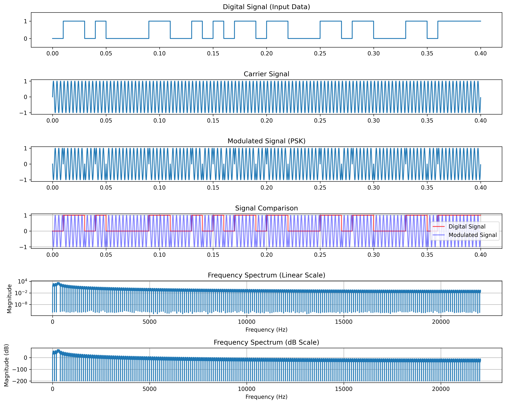
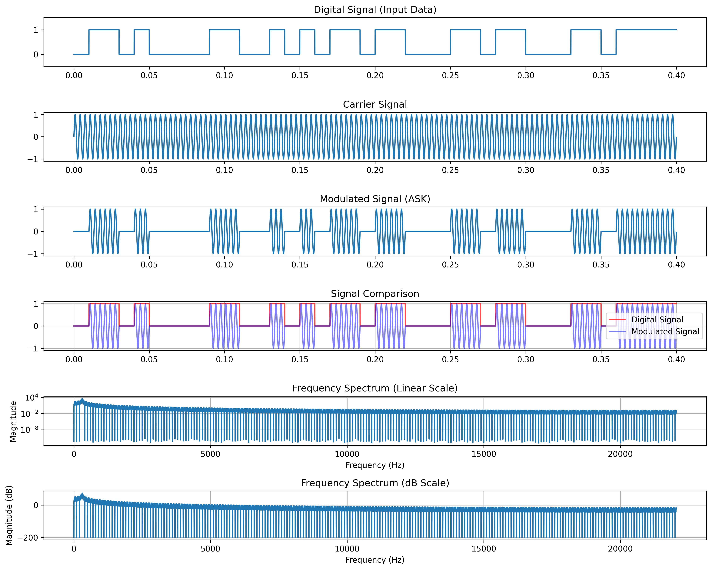

# WaveLab 0.1 - Modulation Simulator with Signal Analysis


A Python-based GUI application for simulating digital and analog modulation techniques with real-time signal analysis.

## 📌 Overview
This project provides a comprehensive tool for simulating various modulation techniques and analyzing their signal characteristics. It features:

- **Digital Modulation:** FSK, PSK, ASK
- **Analog Modulation:** AM, FM
- **Signal Analysis:** Bandwidth, SNR, Spectral Efficiency
- **AES Encryption:** Secure data transmission simulation
- **Audio Playback:** Listen to generated signals
- **Export Options:** Save signals as WAV or plots as PNG/PDF

Built with `tkinter` for the GUI and `matplotlib` for visualization.


## 🛠️ Features
### 1. Modulation Techniques
- **FSK/PSK/ASK:** Digital modulation with configurable carrier frequencies
- **AM/FM:** Analog modulation with customizable parameters

## 🛠️ FSK


## 🛠️ PSK



## 🛠️ ASK



### 2. Signal Analysis
- **Bandwidth Calculation:** FFT-based spectral analysis
- **SNR Estimation:** Signal-to-noise ratio metrics
- **Transmission Distance:** Path loss model for range estimation

### 3. Security
- **AES-128 Encryption:** Secure text input before modulation

### 4. Export & Playback
- Save signals as `.wav` files
- Export plots to `/JPEG/PNG/PDF`
- Real-time audio playback


## ⚙️ Installation
Clone the repository:
```bash
git clone https://github.com/armanghobadi/wavelab.git
cd modulation-simulator
```
Install dependencies:
```bash
pip install -r requirements.txt
```
Run the application:
```bash
python app.py
```

## 📋 Requirements
- **Python 3.8+**
- Required libraries:
```plaintext
numpy, matplotlib, scipy, sounddevice, ttkthemes, pycryptodome
```

## 🎨 GUI Walkthrough
### 1. Signal Parameters
- Input text/message
- Bit rate, carrier frequency, sampling rate
- Duration and amplitude

### 2. Modulation Settings
- **Digital:** FSK/PSK/ASK
- **Analog:** AM/FM
- **Bit-1 frequency** (for FSK)

### 3. Encryption
- Toggle AES-128 encryption
- 16-byte key input

### 4. Analysis
- View bandwidth, SNR, and spectral efficiency
- Estimate transmission distance

## 📊 Example Workflow
1. Enter text (e.g., `Hello`).
2. Select **FSK** modulation with:
   - Carrier = `600 Hz`, Bit-1 Frequency = `1200 Hz`
3. Enable **AES Encryption** (optional).
4. Click **Generate Signal** → View plots.
5. Click **Analyze** → Check SNR/Bandwidth.
6. **Play Audio** or **Save as WAV**.

## 📜 License
This project is licensed under the **MIT License**. See the [LICENSE](LICENSE) file for details.


## 🎯 Key Use Cases
- **Telecommunications education**
- **Signal processing prototyping**
- **Encryption-integrated modulation testing**

---
Made with ❤️ for the signal processing community!